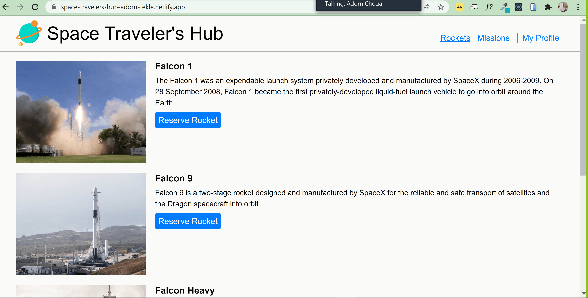

# Space Travelers' Hub

> In this project, the real live data from the SpaceX API is used to build a web application for a fictious company that provides commercial and scientific space travel services. The application allows users to book rockets and join selected space missions.
> The Rockets section displays a list of all available SpaceX rockets. Users can book each rocket by clicking the reservation button or cancel the previously made booking.
> The Missions section displays a list of current missions along with their brief description and participation status. There is also a button next to each mission that allows users to join the selected mission or leave the mission the user joined earlier.

## Built With

- Javascript
- React, Redux
- CSS

## Live Demo

[View live](https://space-travelers-hub-adorn-tekle.netlify.app/)

## Getting Started
To run this application please follow these steps:

1.Clone the repo onto you local machine
 -to clone click on the green 'Code' button and copy the HTTPS link. Using `git clone ` command clone the repository on your local machine.
2.Run `npm install` in the terminal.
3.Run `npm start` to view the website in you default browser or use the Live Server extension in Visual Studio Code.

## Authors

👤 **Adorn**

- GitHub: [@AdornChoga](https://github.com/AdornChoga)
- Twitter: [@adornchoga](https://twitter.com/adorn_choga)
- LinkedIn: [@adornchoga](https://www.linkedin.com/in/adorn-choga)

👤 **Tekle**

- GitHub: [@gtekle](https://github.com/gtekle)
- LinkedIn: [@gtekle](www.linkedin.com/in/gtekle)

## 🤝 Contributing

Contributions, issues, and feature requests are welcome!

Feel free to check the [issues page](../../issues/).

## Show your support

Give a ⭐️ if you like this project!

## Acknowledgments

- We would like to acknowledge SpaceX for their API from which we extracted  the real live data for rockets and missions.

## 📝 License

This project is [MIT](./MIT.md) licensed.